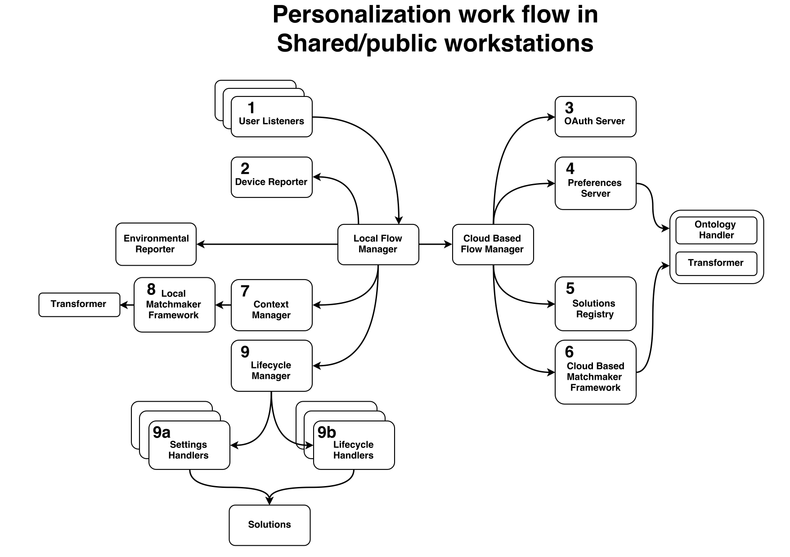

GPII Payloads
==============

Refer to [GPII wiki](https://wiki.gpii.net/w/Main_Page) and [GPII Architecture Dashboard](https://wiki.gpii.net/w/Architecture_Dashboard) to understand what the GPII is.

The GPII core personalisation architecture is held in [the GPII universal repository](https://github.com/gpii/universal).

This repository collects payloads that flow among GPII modules. Refer to the diagram below for the GPII modules as well as the personalization work flow in shared/public workstations.

Each module is mapped to at least one file. 

The file name convention is: `[Cloud|Local]ModuleName[-Functionality].md`.

For example, the payload file for the context manager that is deployed on the local machine to perform the functionality of evaluating match is named as `LocalContextManager-EvaluateMatch.md`. 

These files contain the input payload (or request) that triggers the module to start, as well as the output payload, if any, that the module returns or passes to the next module.

## Coverage
The payloads in this repository cover 3 typical processes that are supported by the GPII deployment for public workstations, shown in the diagram above. These processes are representative but not exhaustive. That said, the payloads collected in this repository do not cover all payloads that flow through GPII. 

The 3 processes covered in this repository are:

* [User Key In Process](#user-content-user-key-in-process)
* [User Key Out Process](#user-content-user-key-out-process)
* [Context Change Process](#user-content-context-change-process)

### User Key In Process

The following is the trace of requests and payloads when a user keys into GPII:

* [Device Reporter](DeviceReporter.md)
* [Cloud-Based Flow Manager in Untrusted Settings](CloudBasedFlowManagerUntrustedSettings.md)
* [Preferences Server](PreferencesServer.md)
* [Solutions Registry](SolutionsRegistry.md)
* [Cloud-Based Matchmaker](CloudBasedMatchMaker.md)
* [OAuth Server](OAuthServer.md)
* [Cloud-Based Context Manager](CloudBasedContextManager.md)
* [Cloud-Based Transformer](CloudBasedTransformer.md)
* [Lifecycle Manager](LifecycleManager-KeyInAndContextChange.md)
* [Settings Handler](SettingsHandler.md)
* [Lifecycle Handlers](LifecycleHandlers.md)

### User Key Out Process

The following is the trace of payloads when a user keys out of GPII:

* [Lifecycle Manager](LifecycleManager-KeyOut.md)
* [Settings Handler](SettingsHandler.md)
* [Lifecycle Handlers](LifecycleHandlers.md)

### Context Change Process

The following is the trace of payloads when a context change is detected within GPII:

* [Environment Reporter](EnvironmentReporter.md)
* [Local Context Manager - Handle Request](LocalContextManager-HandleRequest.md)
* [Local Matchmaker](LocalMatchMaker.md)
* [Local Context Manager - Evaluate Match](LocalContextManager-EvaluateMatch.md)
* [Local Transformer](LocalTransformer.md)
* [Lifecycle Manager](LifecycleManager-KeyInAndContextChange.md)
* [Settings Handler](SettingsHandler.md)
* [Lifecycle Handlers](LifecycleHandlers.md)
